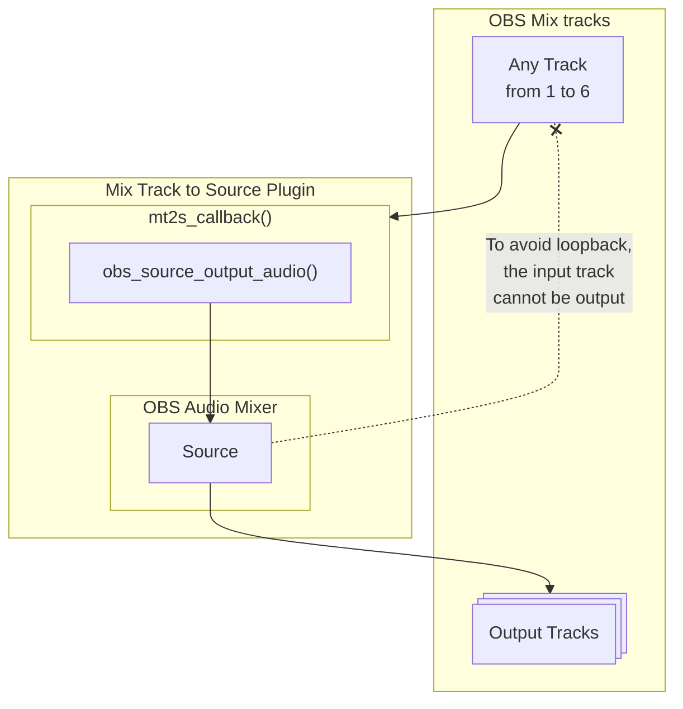
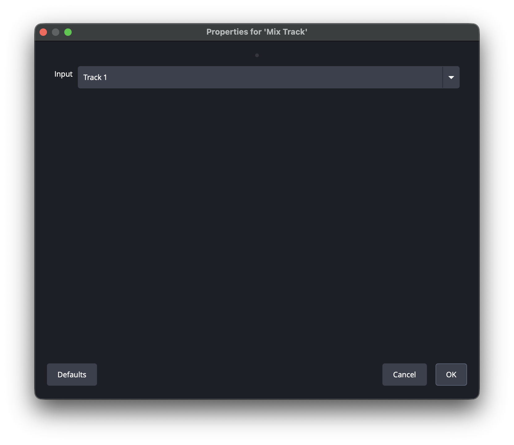
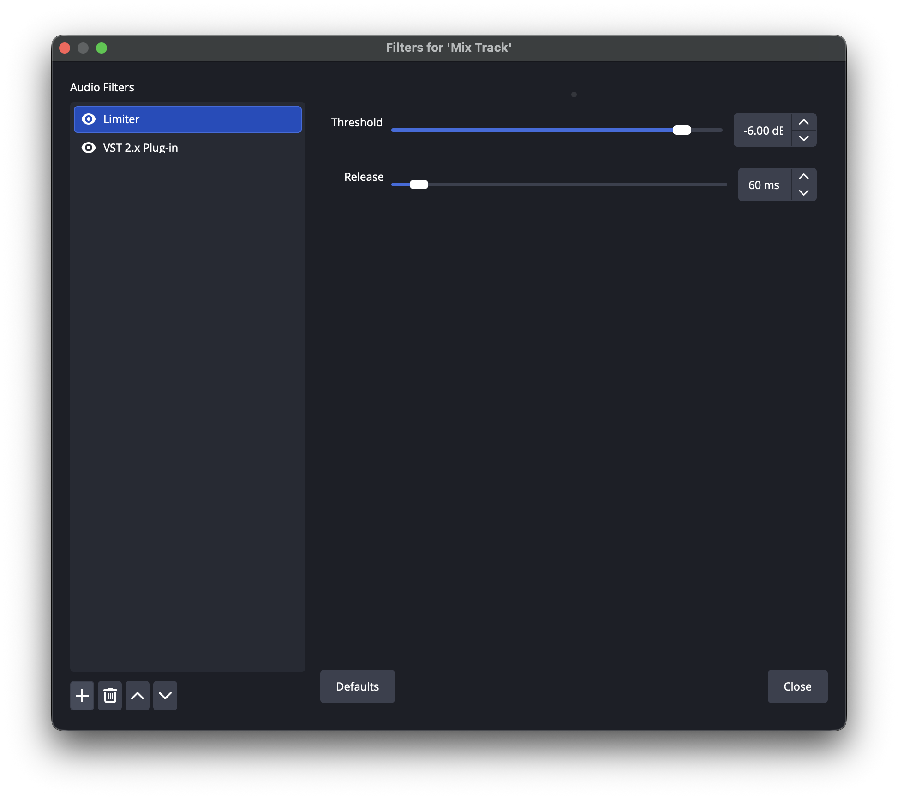
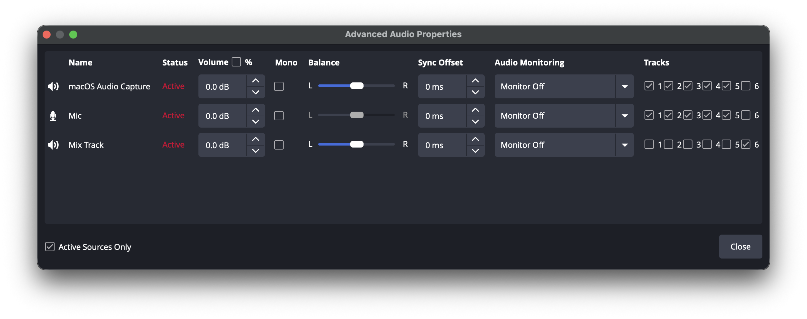
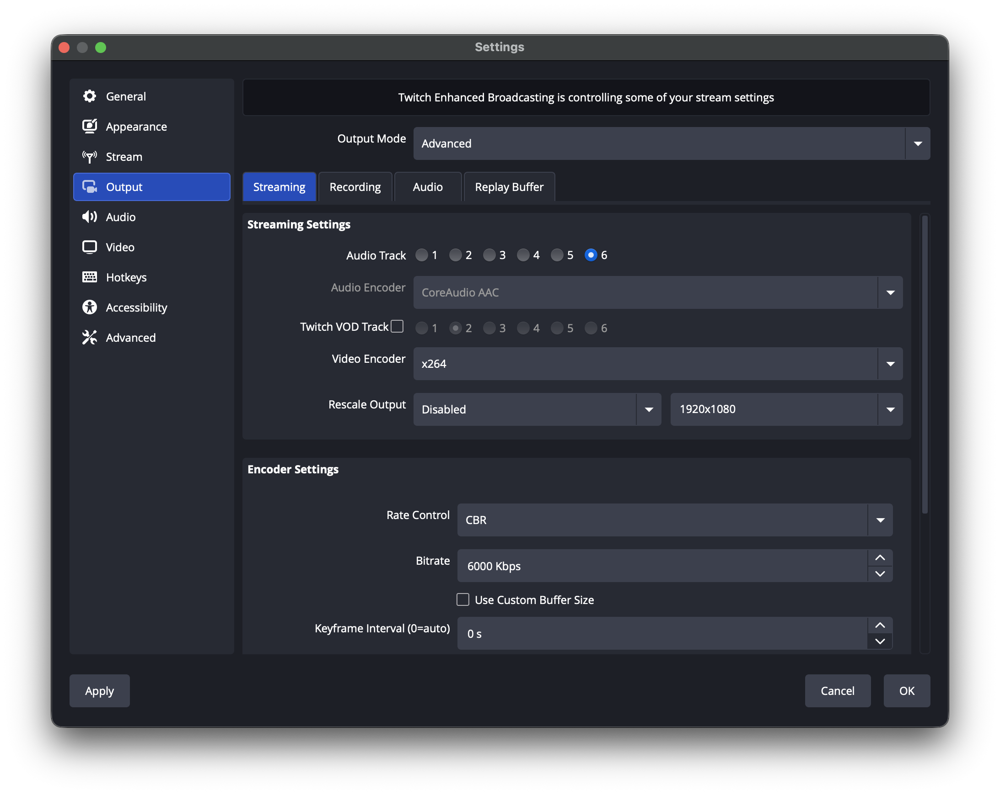

# Mix Track to Source



- Select an input mix track to create an audio source
- The audio source uses the selected mix track as input and allows various filters to be applied
- Allows selection of mix tracks as output, excluding the mix track selected as input
- Buffering causes a minimum delay of 1024 samples (21 ms at 48 kHz)
  - If even greater delay is unacceptable, enable **Low Latency Buffering Mode** in OBS Settings > Audio > Advanced

## Install

Please download the archive file from the [Releases](https://github.com/semnil/MixTrack2Source/releases) page.

### Windows

Run the `mix-track-to-source-<version>-windows-x64-Installer.exe` file to install it.

Alternatively, extract the archive file and place the `mix-track-to-source` folder in the following location:

```
C:\ProgramData\obs-studio\plugins
```


### macOS

Run the `mix-track-to-source-<version>-macos-universal.pkg` file to install it.


### Ubuntu

Run the following command:

```
sudo dpkg -i mix-track-to-source-<version>-x86_64-linux-gnu.deb
```


## Usage

- `Add Source` > `Mix Track` to add an audio source
- Select a mix track to use for input from `Track 1` to `Track 6`
- Select outputs for added audio track in the Advanced Audio Properties window
  - Cannot select the same track for both input and output
  - Deselect the output from other sources as needed

### Usage example

After applying a limiter to the input on Track 1, the settings for outputting the audio to Track 6 for distribution are as follows:






- When adding an audio source, set the input to Track 1
- Add a limiter to the filter of that audio source
- Enable the output of Track 6 for that audio source and disable the output to Track 6 for other audio sources
- Select Track 6 in Settings > Output > Streaming > Streaming Settings > Audio Track


## Information for development

Please refer to the template repository information.  
https://github.com/obsproject/obs-plugintemplate
